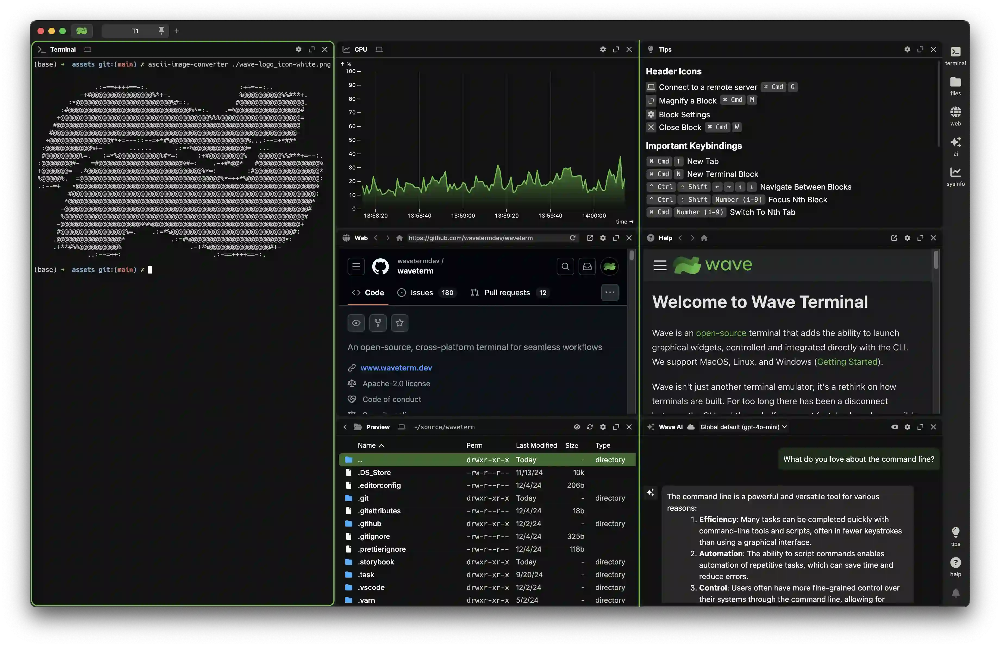

import { Card, CardGroup } from "@site/src/components/card.tsx";

# Welcome to Star Terminal

Star is an [open-source](https://github.com/commandlinedev/starterm) terminal that combines traditional terminal features with graphical capabilities like file previews, web browsing, and AI assistance. It runs on MacOS, Linux, and Windows.

Modern development involves constantly switching between terminals and browsers - checking documentation, previewing files, monitoring systems, and using AI tools. Star brings these graphical tools directly into the terminal, letting you control them from the command line. This means you can stay in your terminal workflow while still having access to the visual interfaces you need.

Check out [Getting Started](./gettingstarted) for installation instructions.

<CardGroup>
  <Card
    href="./customization"
    icon="fa-paintbrush"
    title="Customization"
    description="Set up tabs and terminals to match your workflow needs."
  />
  <Card
    href="./keybindings"
    icon="fa-keyboard"
    title="Key Bindings"
    description="Boost efficiency with keyboard shortcuts for faster navigation."
  />
  <Card
    href="./layout"
    icon="fa-grid-2"
    title="Layout"
    description="Organize your workspace using our layout system."
  />
  <Card
    href="./connections"
    icon="fa-network-wired"
    title="Remote Connections"
    description="Quickly SSH or connect to remote machines in one step."
  />
  <Card
    href="./widgets"
    icon="fa-rocket"
    title="Widgets"
    description="Explore built-in tools to extend your terminal’s functionality."
  />
  <Card
    href="./wsh"
    icon="fa-rectangle-terminal"
    title="wsh Command"
    description="Control Star and launch widgets directly from the command line."
  />
</CardGroup>

:::info

If you have a question, please feel free to ask us in [Discord](https://discord.gg/XfvZ334gwU). If you'd like to file a bug/enchancement, please use [Github Issues](https://github.com/commandlinedev/starterm/issues). These docs are also open-source and we do accept PRs for docs [here](https://github.com/commandlinedev/starterm/blob/main/docs). You can click the "Edit this page" link at the bottom of the page to get taken directly to the editor page for that document in GitHub.

:::

Other References:

- [Configuration](./config)
- [Custom Widgets](./customwidgets)
- [Full wsh reference](./wsh-reference)
- [Telemetry](./telemetry)
- [FAQ](./faq)
- [Release Notes](./releasenotes)

## Roadmap

Star is constantly improving! Our roadmap will be continuously updated with our goals for each release. You can find it [here](https://github.com/commandlinedev/starterm/blob/main/ROADMAP.md).

Want to provide input to our future releases? Connect with us on [Discord](https://discord.gg/XfvZ334gwU) or open a [Feature Request](https://github.com/commandlinedev/starterm/issues/new/choose)!

## Links

- **Homepage** https://commandlinedev.github.io
- **Download** https://commandlinedev.github.io/download
- **Discord** https://discord.gg/XfvZ334gwU
- **GitHub** https://github.com/commandlinedev/starterm/

## Looking for StarLegacy documentation?

StarLegacy docs can be found at [legacycommandlinedev.github.io](https://legacycommandlinedev.github.io).
